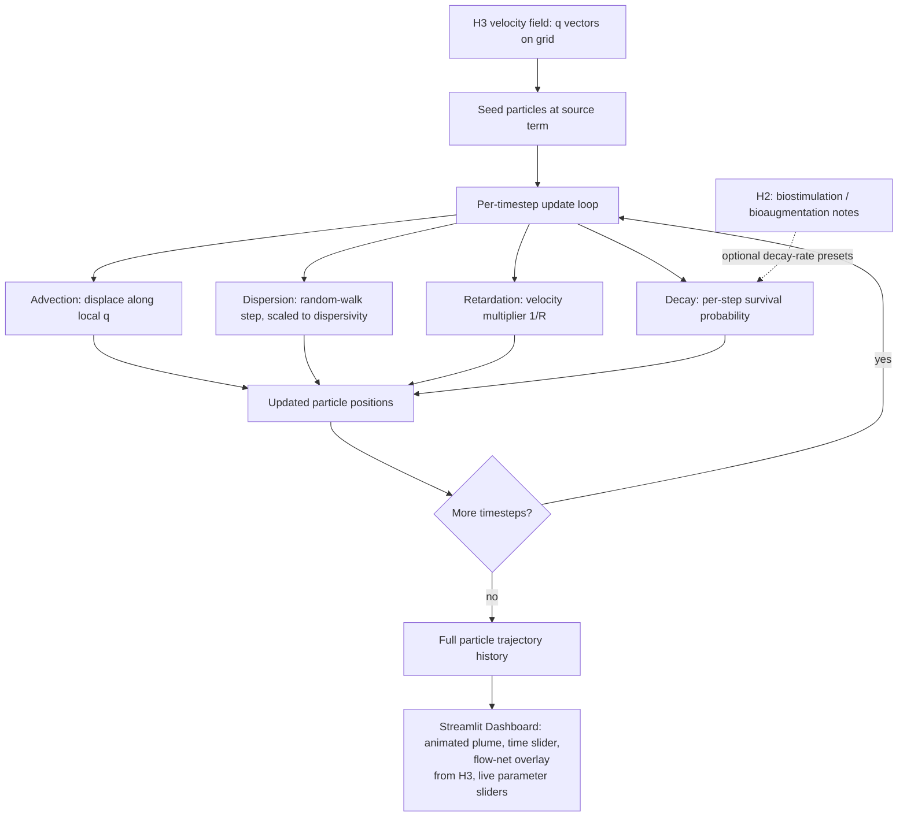

# H4 Pipeline — Contaminant Transport Simulator

**Known limitation (see ADR-001):** particle tracking trades exact mass-balance
accounting for visual/interactive clarity. A grid-based mass-balance check is
deferred to v2.
