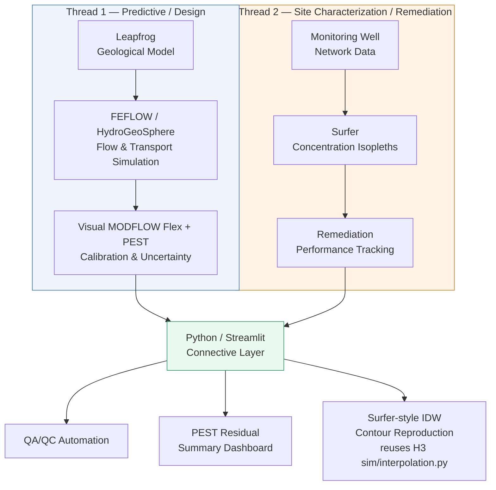

# H5 Pipeline Diagram

## Notes

- **Thread 1** and **Thread 2** run independently — they represent two different real-world workflow patterns from the candidate's project history (predictive design vs. site characterization), not sequential steps of one project.
- The **Python/Streamlit connective layer** is the only node in this diagram that runs live in the deployed app. Everything upstream of it (Leapfrog, FEFLOW/HydroGeoSphere, Visual MODFLOW Flex/PEST, Surfer) is documented as case-study content, not reproduced.
- `D3` intentionally reuses `H3-flow-field-engine/sim/interpolation.py` rather than reimplementing IDW interpolation, keeping the H5 module consistent with the DRY principle applied across H3/H4.